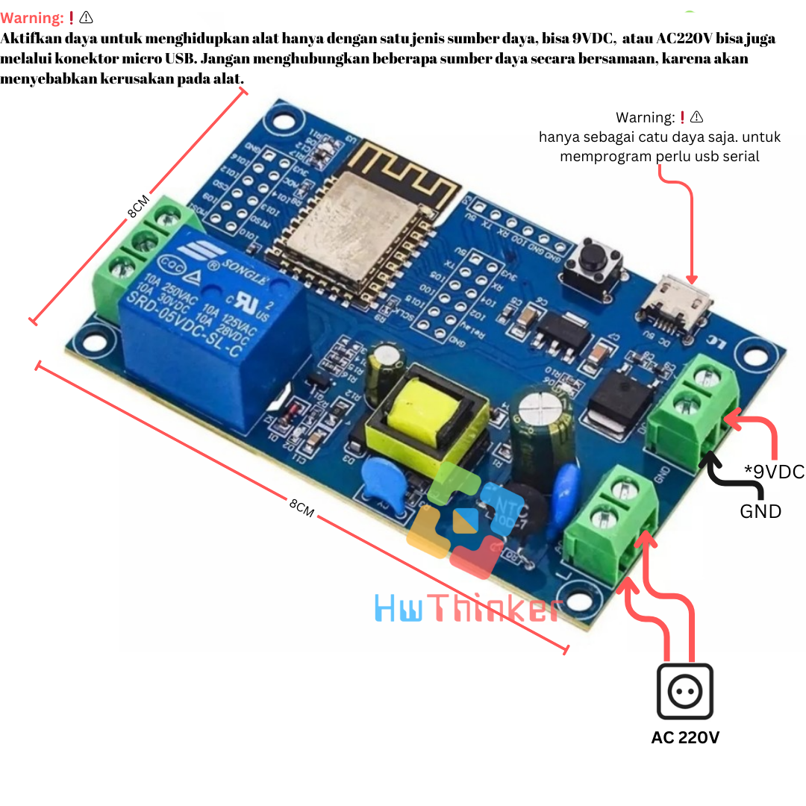
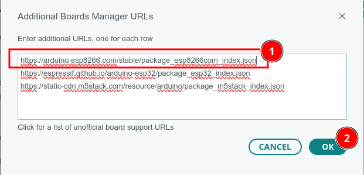
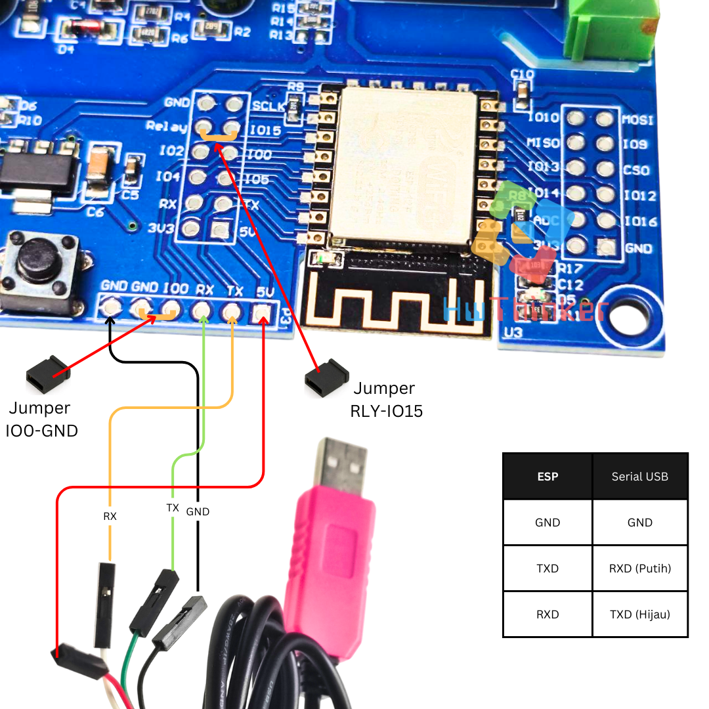

# Modul ESP8266 ESP-12f Relay 1 Channel  10A AC


## Cara install plugin Arduino IDE

### Langkah 1: Buka Arduino IDE

1. Buka aplikasi Arduino IDE di komputer Anda. Jika belum ada, unduh dan instal Arduino IDE dari situs resmi Arduino di https://www.arduino.cc/en/software. disarankan menggunakan arduino ide versi 2

### Langkah 2: Tambahkan URL Board Manager untuk ESP8266

2. Di Arduino IDE, buka **File** > **Preferences**.

   

3. Pada bagian  Additional Boards Manager URLs, tambahkan URL berikut:

```
https://arduino.esp8266.com/stable/package_esp8266com_index.json
```

4. Jika sebelumnya Anda sudah memiliki URL lain di sana, pisahkan URL ini dengan tanda koma atau baris baru.



### Langkah 3: Buka Boards Manager

1. Buka **Tools** > **Board** > **Boards Manager**.


2. Di kotak pencarian, ketik **ESP8266**

### Langkah 4: Instal Board ESP8266

1. Temukan **ESP8266 by Espressif Systems** di daftar, kemudian klik **Install**.


2. Tunggu hingga proses instalasi selesai.

### Langkah 5: Pilih Board ESP8266

1. Setelah instalasi selesai, Anda dapat memilih board ESP8266.
2. Buka **Tools** > **Board**, dan gulir ke bawah untuk menemukan berbagai jenis board ESP8266 yang telah diinstal. Pilih board yang sesuai, misalnya **Nodemcu 1.0 (ESP-12E Module)** 


3. hasilnya kurang lebih seperti ini


### Langkah 6: Pilih Port

1. Sambungkan board esp8266 ke komputer Anda menggunakan kabel USB.
2. Di **Tools** > **Port**, pilih port yang sesuai dengan esp8266 Anda.

## Kode Program

```c++
#include <Arduino.h>

// Definisikan pin LED
#define LED_ESP 2
#define RLY1 15

void setup() {
  // Atur kedua pin sebagai output
  pinMode(LED_ESP, OUTPUT);
  pinMode(RLY1, OUTPUT);
}

void loop() {
  // Nyalakan LED pada pin GPIO2 dan matikan LED pada pin GPIO4
  digitalWrite(LED_ESP, HIGH);
  digitalWrite(RLY1, LOW);
  delay(1000); // Tunggu selama 1 detik

  // Matikan LED pada pin GPIO2 dan nyalakan LED pada pin GPIO4
  digitalWrite(LED_ESP, LOW);
  digitalWrite(RLY1, HIGH);
  delay(1000); // Tunggu selama 1 detik
}
```


## Aktivasi Relay

Relay defaultnya tidak terhubung ke GPIO. Pasang Relay ke GPIO 15 agar relay bisa dkontrol oleh pin GPIO15  yang  ada di esp8266


## Cara upload program dengan serial usb



- Lepas Semua Sambungan Power supply
- Pastikan jumper relay sudah terpasang ke GPIO15 (!Penting)
- Pasang serial USB TTL dengan ketentuan RX -> TX USB Serial ; TX -> RX USB Serial; GND -> GND USB Serial; pasang 5V -> 5V USB serial 
- pasang Jumper ke IO0 dan GND
- pasang USB serial ke komputer
- Tekan dan lepas tombo reset dengan jumper tetap terpasang ke IO0 dan GND
- upload  program 
- lepas jumper
- tekan dan lepas tombol reset untuk run-program
- ulang langkah awal untuk download ulang

